# PRD: Team Management — Party Domain

> **Status:** Living Document  
> **Domain:** Party Management Experience (`partyManagementExperienceService`)  
> **Last Updated:** April 10, 2026

---

## Table of Contents

1. [Overview](#1-overview)
2. [Key Concepts & Glossary](#2-key-concepts--glossary)
3. [System Architecture](#3-system-architecture)
4. [Data Model](#4-data-model)
5. [Roles & Permissions](#5-roles--permissions)
6. [Feature Catalog](#6-feature-catalog)
  - [F1 – User Registration & Provisioning](#f1--user-registration--provisioning)
  - [F2 – Team (Organization) CRUD](#f2--team-organization-crud)
  - [F3 – Team Member Management](#f3--team-member-management)
  - [F4 – Invitation Flow (Standard)](#f4--invitation-flow-standard)
  - [F5 – Invitation Flow (External IdP / Microsoft Entra)](#f5--invitation-flow-external-idp--microsoft-entra)
  - [F6 – Invitation Validation & Acceptance](#f6--invitation-validation--acceptance)
7. [API Reference Summary](#7-api-reference-summary)
8. [Orchestration Plans (Internal Workflows)](#8-orchestration-plans-internal-workflows)
9. [Events & Notifications](#9-events--notifications)
10. [Authorization Model](#10-authorization-model)
11. [Configuration Reference](#11-configuration-reference)
12. [Roadmap & Future Enhancements](#12-roadmap--future-enhancements)

---

## 1. Overview

Team Management is a core capability of the **Party Management Experience Service** (PMExp). It enables organizations (tenants / operators) to manage **teams** composed of **users**, control who belongs to which team, and handle the **invitation lifecycle** for onboarding new members.

Teams are modelled as `Organization` entities in the TM Forum Party Management standard, and users are modelled as `Individual` entities. PMExp provides an experience layer on top of the raw TM Forum APIs, orchestrating multi-step workflows atomically via Orchestration Engine (OE) plans.

### Who uses this?


| Persona              | What they do                                                           |
| -------------------- | ---------------------------------------------------------------------- |
| **Admin**            | Creates/manages teams, invites users, removes members, deletes teams   |
| **Team Manager**     | Manages members within their own team                                  |
| **Developer**        | Standard team member with read/write access to team resources          |
| **System / Service** | Internal service accounts that provision users and teams via S2S flows |


---

## 2. Key Concepts & Glossary


| Term                       | Description                                                                                                                                                                 |
| -------------------------- | --------------------------------------------------------------------------------------------------------------------------------------------------------------------------- |
| **Organization**           | TM Forum Party entity of type `Organization`. Represents either a **root organization** (head office, `isHeadOffice=true`) or a **team** (child org, `isHeadOffice=false`). |
| **Individual**             | TM Forum Party entity of type `Individual`. Represents a user.                                                                                                              |
| **RelatedParty**           | A link between an `Organization` and an `Individual` that carries a **role** (e.g. `operateApiAdmin`).                                                                      |
| **Root Organization**      | The top-level organization that owns child teams. Admins of the root org have access to all child teams.                                                                    |
| **Team**                   | A child `Organization` nested under a root organization. Users can belong to one or more teams.                                                                             |
| **Invitation**             | A persistent record that tracks the process of inviting an email address to a team/organization, including its status and a unique one-time code.                           |
| **Invitation Code**        | A random 32-byte `base64url` string generated per invitation, used to accept the invite.                                                                                    |
| **Digital Identity**       | A record in the Digital Identity Service that links a Keycloak `sub` (IDP ID) to a Party `Individual` ID.                                                                   |
| **OrchestrationPlan (OE)** | A JSON-defined state machine that coordinates multi-step API calls atomically across services.                                                                              |
| **Lua Permissions**        | The LotusFlare authorization service. Permissions are granted with a `caller_id`, `target_type`, `target_id`, and `role`.                                                   |
| **External IdP**           | An external Identity Provider (currently: **Microsoft Entra ID**). Used for guest user provisioning in specific operator configurations.                                    |
| **Onboarding Type**        | Operator-level configuration: `DIRECT` (customer self-serve) or `WHOLESALE` (partner-managed). Affects which party roles are provisioned on registration.                   |


---

## 3. System Architecture

### High-Level Component Diagram

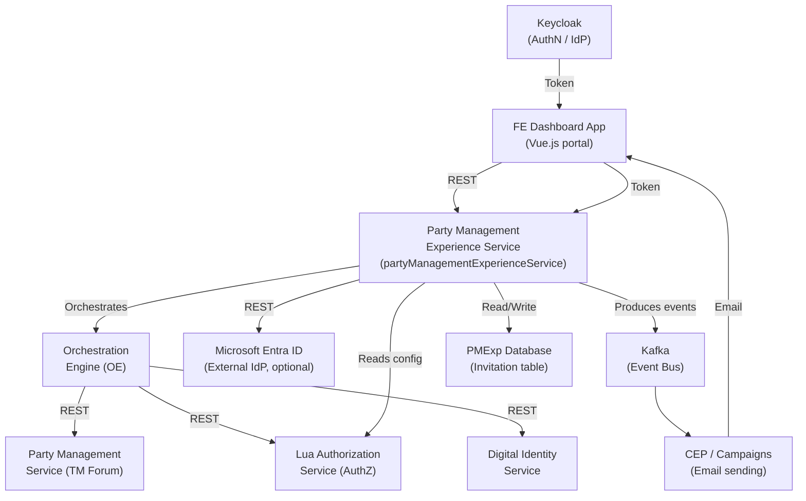


### Module Structure (within PMExp)

```
partyManagementExperienceService/
├── src/
│   ├── common/
│   │   ├── constants/
│   │   │   └── enum.ts             ← PartyExperienceMetricOperation, ExternalIdpProvisioningPhase enums
│   │   └── plans/default/          ← OE orchestration plan JSON files
│   └── module/
│       ├── teamManagementExperience/      ← Core team management module
│       │   ├── controller/
│       │   │   ├── http/team/             ← Team CRUD + member endpoints
│       │   │   ├── http/invitation/       ← Invitation endpoints (external callers)
│       │   │   └── http/invitationInternal/ ← Invitation endpoints (internal/OE)
│       │   ├── domain/service/
│       │   │   ├── impl/TeamService.ts
│       │   │   ├── impl/InvitationService.ts
│       │   │   ├── impl/TeamMemberService.ts
│       │   │   ├── impl/InvitationSenderService.ts
│       │   │   ├── impl/InvitationValidator.ts
│       │   │   ├── externalIdp/
│       │   │   │   ├── EntraIdpProvider.ts
│       │   │   │   ├── EntraGraphClient.ts  ← MS Graph API client (guest user + group management)
│       │   │   │   └── NoOpIdpProvider.ts   ← Default no-op (operators without Entra config)
│       │   │   └── operatorImplementation/
│       │   │       ├── OperatorImplementationFactory.ts
│       │   │       ├── DefaultOperatorImplementation.ts
│       │   │       └── IOperatorImplementation.ts
│       │   ├── mappingProfiles/
│       │   │   ├── InvitationProfile.ts
│       │   │   ├── TeamMemberProfile.ts
│       │   │   └── TeamProfile.ts
│       │   └── constants/constants.ts     ← MemberRole, InvitationSource enums
│       ├── userProfileManagementExperience/ ← User registration + update module
│       ├── experienceService/             ← Party/PartyRole management module
│       ├── customer/                      ← Customer creation module
│       └── util/                          ← Shared utilities (auth, config, orchestration, onboarding, validation, party, resource proxy)
```

---

## 4. Data Model

### Entity Relationship Diagram

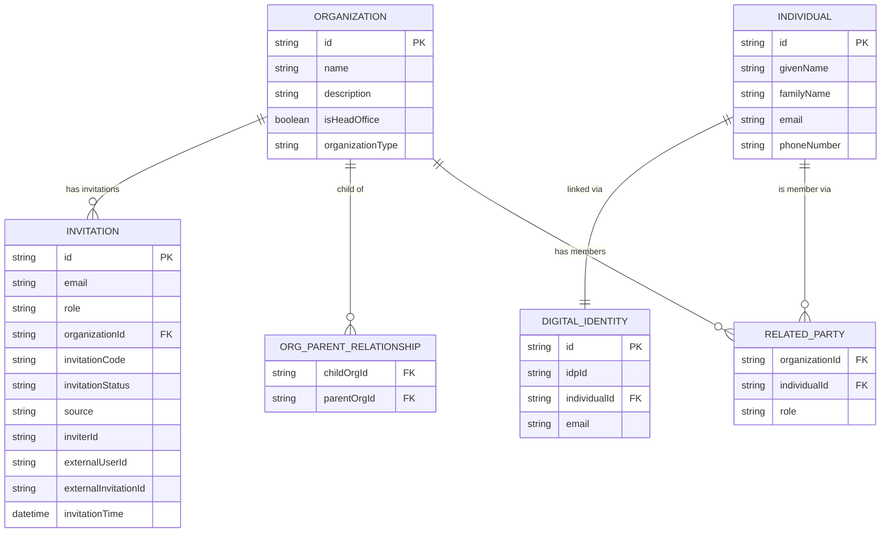


### Invitation Status State Machine

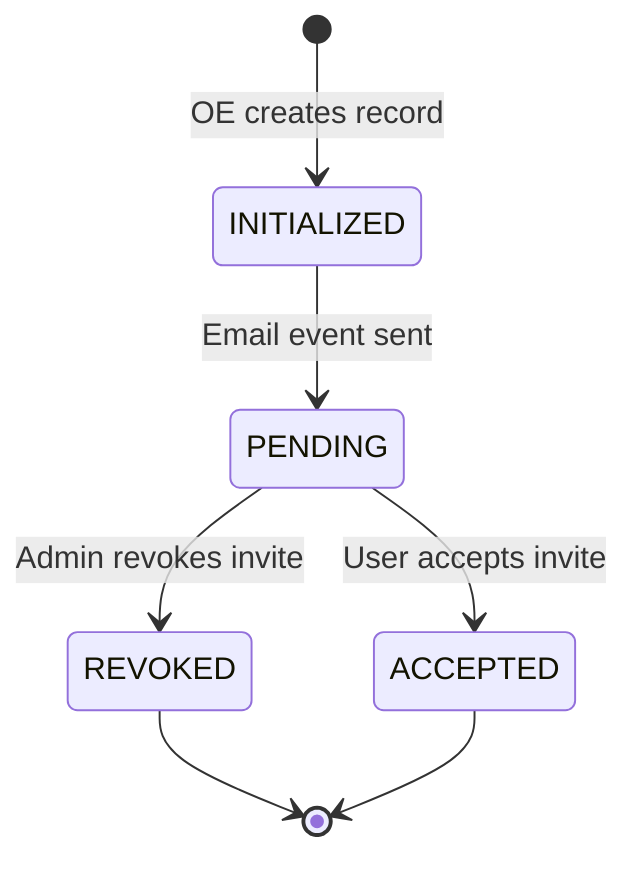


---

## 5. Roles & Permissions

There are **3 team roles**, mapped to the underlying Lua `RoleEnum`:


| Team Role      | Lua RoleEnum       | Description                                            |
| -------------- | ------------------ | ------------------------------------------------------ |
| `ADMIN`        | `operateApiAdmin`  | Full control over the organization and all child teams |
| `TEAM_MANAGER` | `operateApiEditor` | Can manage members within their own team               |
| `DEVELOPER`    | `operateApiViewer` | Standard member, read/write on team resources          |


### Role Mapping Diagram

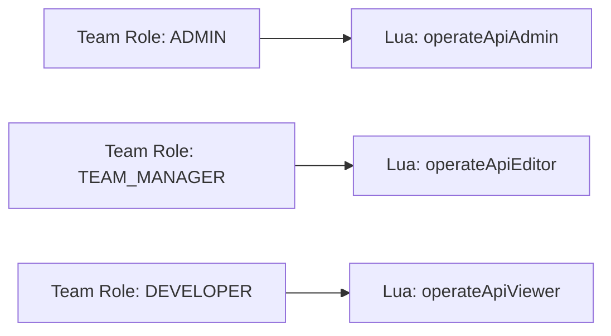


### Permission Scope Rules


| Action             | Required Role                                                      |
| ------------------ | ------------------------------------------------------------------ |
| Create team        | `ADMIN` on parent organization                                     |
| Update/delete team | `ADMIN` or `TEAM_MANAGER` on team                                  |
| Get team           | Any member of the team                                             |
| Get my teams       | Any authenticated user                                             |
| Invite member      | `ADMIN` on parent org (for ADMIN invite) or `TEAM_MANAGER` on team |
| Revoke invitation  | `ADMIN` or `TEAM_MANAGER` on organization                          |
| Accept invitation  | Invited user (email must match token)                              |
| Update member role | `ADMIN` or `TEAM_MANAGER` on team                                  |
| Delete team member | `ADMIN` or `TEAM_MANAGER` on team                                  |


---

## 6. Feature Catalog

---

### F1 – User Registration & Provisioning

**Summary:** When a new user registers, PMExp provisions their `Individual` party record, links it to their IDP identity (Keycloak), and optionally creates a default root organization and party roles.

**User Flow:**

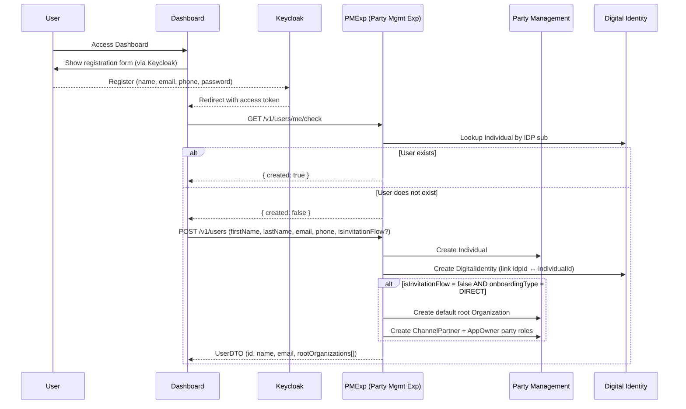


**Orchestration Plans Used:**

- `team_mgmt_exp_create_user` — full self-serve registration
- `team_mgmt_exp_create_internal_user` — S2S provisioning (Individual + DigitalIdentity only)
- `team_mgmt_exp_provision_default_organization` — creates root org when needed

**Key Validation:**

- Invitation code presence is checked → if valid, `isInvitationFlow=true` suppresses default org creation

---

### F2 – Team (Organization) CRUD

**Summary:** Admins can create, retrieve, update, and delete teams (child organizations) within a root organization.

#### Create Team

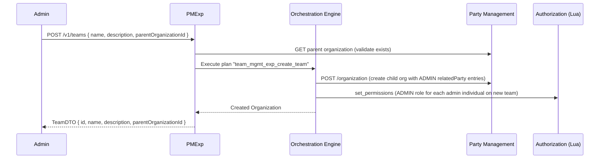


**Business Rules:**

- Creator is automatically added as `ADMIN` of the new team
- All existing `ADMIN` members of the parent org are also added as `ADMIN` of the new team
- `parentOrganizationId` must be a valid, existing organization

#### Update Team

- `PATCH /v1/teams/:teamId` — updates `name` and/or `description`
- Orchestration plan: `team_mgmt_exp_update_team`

#### Delete Team

- `DELETE /v1/teams/:teamId` — deletes the team and revokes all member permissions
- Orchestration plan: `team_mgmt_exp_delete_team`
- Steps: (1) Delete Lua permissions for all members, (2) Delete organization via Party Management

#### Get Team

- `GET /v1/teams/:teamId` — returns team details (`id`, `name`, `description`, `parentOrganizationId`, `membersCount`)

#### Get My Teams

- `GET /v1/teams/me?organizationId=<rootOrgId>` — returns all teams the current user belongs to within a root org
- Optional `withMembers=true` param enriches the response with member details
- Admins of root org see **all** teams; non-admins see only their own teams

---

### F3 – Team Member Management

**Summary:** Manage who belongs to a team, their role, and allow removal of members.

#### Get Team Members

- `GET /v1/teams/:teamId/members` — returns list of members with name, role, and individual details
- Also available as an internal route: `GET /v1/teams/internal/:teamId/members`

**Flow:**

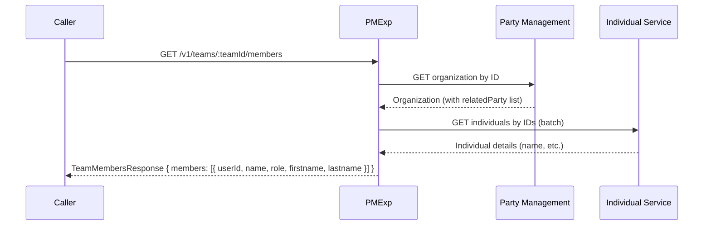


#### Update Team Member Role

- `PATCH /v1/teams/:teamId/members/:memberId` — updates the member's role (`TEAM_MANAGER` or `DEVELOPER`)
- Orchestration plan: `team_mgmt_exp_update_team_member_role`
- Steps: (1) Update `relatedParty.role` in Party Management, (2) Update Lua permissions

#### Delete Team Member

- `DELETE /v1/teams/:teamId/members/:memberId`
- If the target org is the **root org**: also removes the user from **all child teams**
- Orchestration plan: `team_mgmt_exp_delete_team_member`
- Steps: (1) Delete Lua permissions for all orgs, (2) Remove `relatedParty` from each org (loop)

#### Add Team Member (Internal)

- `POST /v1/teams/:teamId/members/:memberId` — internal-only endpoint for service flows
- Used during invitation acceptance to add the user to the team programmatically
- Orchestration plan: `team_mgmt_exp_add_member_to_team`

---

### F4 – Invitation Flow (Standard)

**Summary:** An admin/manager invites a user by email to join a team. The user receives an email with a one-time code, registers or logs in, and accepts the invitation.

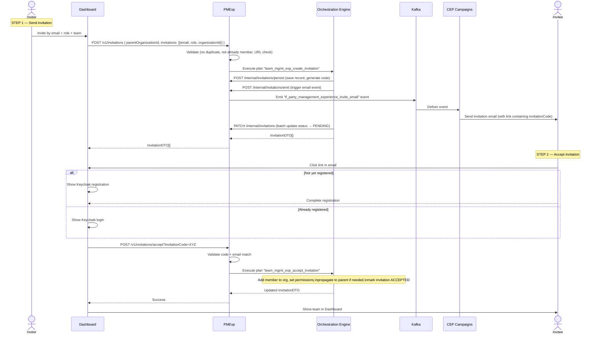


**Invitation validations:**

- User is not already a member of the target organization
- User does not already have a `PENDING` or `INITIALIZED` invitation for the same organization
- `invitationUrl` must be from the configured `dashboard_app_domains` list (when configured)
- Only `ADMIN` users of the parent org can invite users with the `ADMIN` role

---

### F5 – Invitation Flow (External IdP / Microsoft Entra)

**Summary:** For operators using **Microsoft Entra ID** as external Identity Provider (e.g. T-Mobile DevEdge), invitations also provision the user as an Entra guest, granting access to Entra-protected resources via Access Packages.

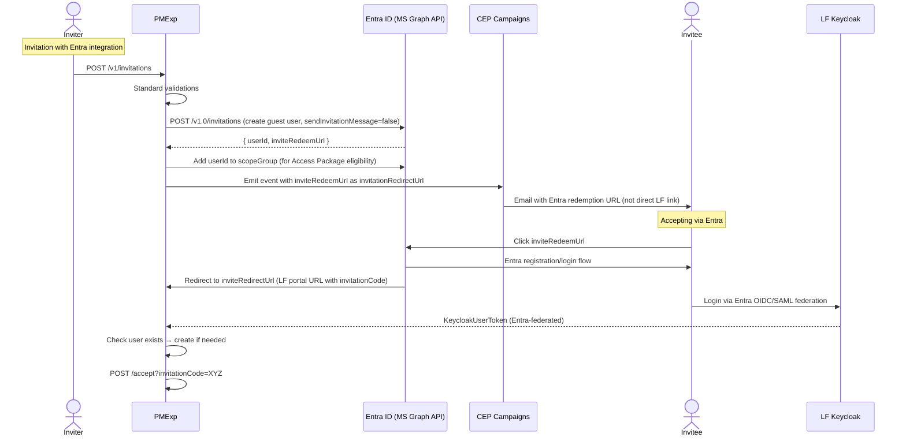


**Key Differences from Standard Flow:**

- `externalUserId` and `externalInvitationId` are stored on the invitation record
- Email link points to Entra's `inviteRedeemUrl`, not directly to the dashboard
- Revoking an invitation also calls `removeUserFromGroup` in Entra to revoke Access Package eligibility
- Falls back gracefully if Entra API fails (invitation continues without external IdP linkage, with warning metrics emitted)

**Operator Configuration Required (per-operator):**


| Field                  | Description                                                                                                       |
| ---------------------- | ----------------------------------------------------------------------------------------------------------------- |
| `provider`             | `"entra"`                                                                                                         |
| `authMethod`           | `"client_secret"` or `"jwt_client_assertion_certificate"`                                                         |
| `tenantId`             | Azure AD Tenant ID                                                                                                |
| `clientId`             | App Registration Client ID                                                                                        |
| `clientSecret`         | Client secret *(required when `authMethod = "client_secret"`)*                                                    |
| `certificate`          | X.509 certificate string *(required when `authMethod = "jwt_client_assertion_certificate"`)*                      |
| `privateKey`           | Private key for signing JWT client assertions *(required when `authMethod = "jwt_client_assertion_certificate"`)* |
| `scopeGroupId`         | Entra Security Group ID (for Access Package scope)                                                                |
| `accessPackageId`      | Entra Access Package ID                                                                                           |
| `tenantDomain`         | e.g. `contoso.onmicrosoft.com`                                                                                    |
| `inviteRedirectUrl`    | Keycloak broker endpoint or portal URL                                                                            |
| `tokenEndpointBaseUrl` | Optional: Base URL for Entra token endpoint. Defaults to `https://login.microsoftonline.com`                      |
| `accessPackageBaseUrl` | Optional: Base URL for Entra My Access portal links. Defaults to `https://myaccess.microsoft.com`                 |


---

### F6 – Invitation Validation & Acceptance

**Summary:** Before accepting an invitation, the frontend validates the code. After login/registration, the user accepts the invitation to be added to the team.

#### Validate Invitation

- `POST /v1/invitations/validate { invitationCode }`
- Returns `{ valid: true/false }` — checks if a PENDING invitation exists for the current user's email

#### Accept Invitation

**Acceptance Logic (simplified):**

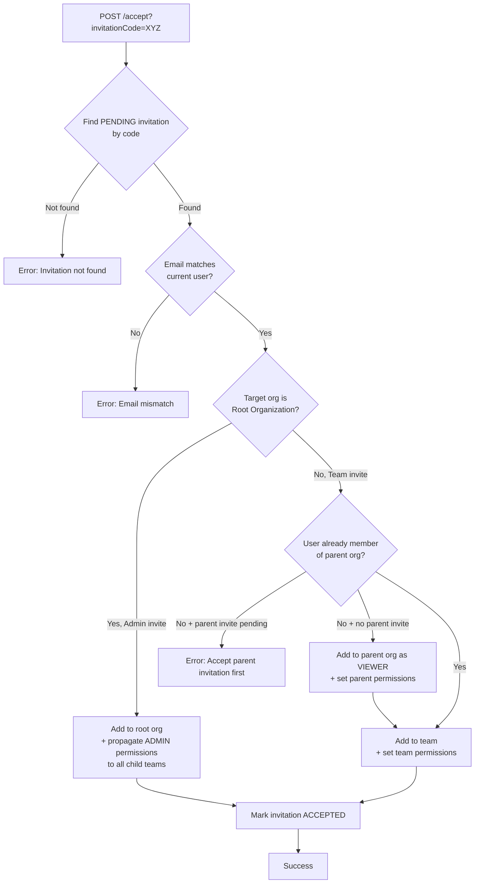


#### List Invitations

- `GET /v1/invitations?organizationId=<id>&status=<optional>` — list invitations for a team
- Optional `status` filter: `INITIALIZED`, `PENDING`, `ACCEPTED`, `REVOKED`

#### Revoke Invitation

- `DELETE /v1/invitations/:id/revoke?organizationId=<id>`
- Cannot revoke an already `ACCEPTED` invitation
- If `externalUserId` is present → also calls Entra to revoke the guest user's group membership

---

### F7 – Update User Profile

**Summary:** An authenticated user can update their own profile information (first name, last name) via `PATCH /v1/users/me`. The update propagates to the underlying `Individual` party record in Party Management.

**Orchestration Plan:** `team_mgmt_exp_update_user`


| Step | Action                                                     |
| ---- | ---------------------------------------------------------- |
| 1    | Resolve `individualId` from the current user's JWT context |
| 2    | PATCH the `Individual` entity in Party Management          |
| 3    | Return the updated `UserDTO`                               |


---

### F8 – Onboard User (Service-to-Service)

**Summary:** An internal service can onboard an existing user to an existing organization via `POST /v1/users/onboard`. This is a service-to-service flow (Keycloak user tokens are not allowed) designed for wholesale or partner-managed onboarding scenarios where a user is created on behalf of an existing operator.

**Key Differences from F1 (self-serve registration):**

- Caller is a service account, not a human user
- The organization already exists; no default org provisioning occurs
- `isInvitationFlow` is implicitly `true` — no root org is created

---

### F9 – Update User Webhook (IdP Event Handler)

**Summary:** PMExp exposes `POST /v1/users/updateUserWebhook` as a webhook endpoint for Identity Provider (e.g. Keycloak) user-update events. When a user's attributes change in the IdP, the IdP emits an event to this endpoint, which propagates the change to the `Individual` party record in Party Management.

**Flow:**

1. Keycloak triggers the webhook with a `UserEventWebhook` payload (`{ user: { id, firstName, lastName } }`)
2. PMExp resolves the `individualId` from the `idpId` via Digital Identity Service
3. PMExp sets the user context and calls `updateUser` to PATCH the `Individual` in Party Management

**Auth:** Service token only (Keycloak user tokens are disallowed)

---

## 7. API Reference Summary

### Team Endpoints (`/v1/teams`)


| Method   | Path                                  | Description              | Auth                |
| -------- | ------------------------------------- | ------------------------ | ------------------- |
| `GET`    | `/v1/teams/me?organizationId=`        | Get my teams             | Keycloak user token |
| `GET`    | `/v1/teams/:teamId`                   | Get team by ID           | Keycloak user token |
| `GET`    | `/v1/teams/:teamId/members`           | Get team members         | Keycloak user token |
| `POST`   | `/v1/teams`                           | Create team              | Keycloak user token |
| `PATCH`  | `/v1/teams/:teamId`                   | Update team              | Keycloak user token |
| `DELETE` | `/v1/teams/:teamId`                   | Delete team              | Keycloak user token |
| `DELETE` | `/v1/teams/:teamId/members/:memberId` | Remove member            | Keycloak user token |
| `PATCH`  | `/v1/teams/:teamId/members/:memberId` | Update member role       | Keycloak user token |
| `POST`   | `/v1/teams/:teamId/members/:memberId` | Add member *(internal)*  | Service token       |
| `GET`    | `/v1/teams/internal/:teamId/members`  | Get members *(internal)* | Service token       |


### Invitation Endpoints (`/v1/invitations`)


| Method   | Path                                     | Description               | Auth                |
| -------- | ---------------------------------------- | ------------------------- | ------------------- |
| `POST`   | `/v1/invitations`                        | Create invitations        | Keycloak user token |
| `GET`    | `/v1/invitations?organizationId=`        | List invitations for team | Keycloak user token |
| `POST`   | `/v1/invitations/accept?invitationCode=` | Accept invitation         | Keycloak user token |
| `DELETE` | `/v1/invitations/:id/revoke`             | Revoke invitation         | Keycloak user token |
| `POST`   | `/v1/invitations/validate`               | Validate invitation code  | Any token           |


### Internal Invitation Endpoints (`/v1/internal/invitations`)


| Method   | Path                                  | Description                               | Auth                  |
| -------- | ------------------------------------- | ----------------------------------------- | --------------------- |
| `POST`   | `/v1/internal/invitations`            | Create invitations (S2S)                  | Service/Lua token     |
| `GET`    | `/v1/internal/invitations`            | List invitations (S2S)                    | Service/Lua token     |
| `GET`    | `/v1/internal/invitations/:id`        | Get invitation by ID                      | Service/Lua token     |
| `PATCH`  | `/v1/internal/invitations/:id`        | Update invitation                         | Service/Lua token     |
| `DELETE` | `/v1/internal/invitations/:id/revoke` | Revoke invitation (S2S)                   | Service/Lua token     |
| `PATCH`  | `/v1/internal/invitations`            | Batch update invitations                  | Service/Lua token     |
| `POST`   | `/v1/internal/invitations/persist`    | Persist invitation records only (OE step) | Lua/K8s service token |
| `POST`   | `/v1/internal/invitations/emit`       | Emit invitation email events (OE step)    | Lua/K8s service token |


### User Endpoints (`/v1/users`)


| Method  | Path                          | Description                               | Auth                |
| ------- | ----------------------------- | ----------------------------------------- | ------------------- |
| `GET`   | `/v1/users/me/check`          | Check if user is created                  | Any token           |
| `POST`  | `/v1/users`                   | Create user (self-serve)                  | Keycloak user token |
| `GET`   | `/v1/users/me`                | Get current user                          | Keycloak user token |
| `PATCH` | `/v1/users/me`                | Update current user                       | Keycloak user token |
| `POST`  | `/v1/users/internal`          | Create Individual + DigitalIdentity (S2S) | Service token       |
| `POST`  | `/v1/users/onboard`           | Onboard user to existing org (S2S)        | Service token       |
| `POST`  | `/v1/users/updateUserWebhook` | Webhook: update user from IdP event       | Service token       |


### Party/PartyRole Endpoints (`experienceService` module)


| Method   | Path                                           | Description                                                          | Auth              |
| -------- | ---------------------------------------------- | -------------------------------------------------------------------- | ----------------- |
| `POST`   | `/v1/createPartyWithPartyRoles`                | Create a Party (Individual or Organization) and assign party roles   | Service token     |
| `POST`   | `/v2/createPartyRolesWithParty`                | Create a single Party Role and link it to an existing Party          | Service token     |
| `POST`   | `/v1/batchCreatePartyRolesAndAssociateToParty` | Batch-create Party Roles and link them to an existing Party          | Service token     |
| `POST`   | `/v1/deletePartyRolesWithParty`                | Delete Party Roles and their association to a Party                  | Service token     |
| `DELETE` | `/v1/individual/:id`                           | Delete an Individual party (must pass deletion eligibility checks)   | Service/Lua token |
| `DELETE` | `/v1/organization/:id`                         | Delete an Organization party (must pass deletion eligibility checks) | Service/Lua token |
| `GET`    | `/v1/organization/:id/accessList`              | Get all individuals with permissions over an Organization            | Service token     |


> **Deletion eligibility** is enforced by `PartyDeletionValidationService` + `PartyDeletionBlockingCriteria`. A party cannot be deleted if it has active subscriptions, products (pendingActive/active/pendingTerminate), open payments, refunds, payment plans, charge plans, open product orders, billing accounts with a non-zero balance, open customer bills, or (for Organizations) open quotes.

### Customer Endpoints (`customer` module)


| Method | Path            | Description                                    | Auth          |
| ------ | --------------- | ---------------------------------------------- | ------------- |
| `POST` | `/v1/customers` | Create a customer entity (Direct or Wholesale) | Service token |


> Supports two body schemas: `CustomerCreateRequestDirect` (for `DIRECT` onboarding type) and `CustomerCreateRequestWholesale` (for `WHOLESALE` onboarding type).

---

All multi-step operations are executed as **Orchestration Engine (OE) plans** — JSON state machines that coordinate calls across microservices with pause-and-resume support.


| Plan ID                                                 | Trigger                                             | Key Steps                                                                                        |
| ------------------------------------------------------- | --------------------------------------------------- | ------------------------------------------------------------------------------------------------ |
| `team_mgmt_exp_create_team`                             | Create team API                                     | Create Organization → Set admin permissions (Lua)                                                |
| `team_mgmt_exp_update_team`                             | Update team API                                     | Update Organization                                                                              |
| `team_mgmt_exp_delete_team`                             | Delete team API                                     | Delete permissions for all members → Delete Organization                                         |
| `team_mgmt_exp_delete_team_member`                      | Remove member API                                   | Delete member permissions → Remove relatedParty from each org (loop)                             |
| `team_mgmt_exp_update_team_member_role`                 | Update role API                                     | Update relatedParty role → Update Lua permissions                                                |
| `team_mgmt_exp_add_member_to_team`                      | Add member (internal)                               | Add relatedParty to org → Set Lua permissions                                                    |
| `team_mgmt_exp_create_invitation`                       | Create invitation API                               | Persist records → Emit email events → Batch update status to PENDING                             |
| `team_mgmt_exp_accept_invitation`                       | Accept invitation API                               | Optionally add to parent org → Add to team → Set permissions → Propagate aliases → Mark ACCEPTED |
| `team_mgmt_exp_create_user`                             | User registration                                   | Create Individual → Create DigitalIdentity → Optionally provision org + party roles              |
| `team_mgmt_exp_create_internal_user`                    | Internal user creation                              | Create Individual → Create DigitalIdentity → Set default self-permissions                        |
| `team_mgmt_exp_provision_default_organization`          | User registration (no invite)                       | Create root Organization → Create party roles (ChannelPartner, AppOwner)                         |
| `team_mgmt_exp_set_permission_aliases_for_organization` | After accept                                        | Set permission aliases (Wholesale/Direct specific)                                               |
| `team_mgmt_exp_update_user`                             | `PATCH /v1/users/me` or webhook                     | Patch Individual in Party Management with updated name fields                                    |
| `team_mgmt_exp_delete_single_user`                      | Delete single user (internal/S2S)                   | Remove relatedParty from all orgs → Delete Lua permissions → Delete Individual + DigitalIdentity |
| `team_mgmt_exp_delete_users`                            | Batch delete users (internal/S2S)                   | Same as above, executed for each user in the batch                                               |
| `create_customer`                                       | `POST /v1/customers`                                | Create customer entity (Direct or Wholesale) via Party + PartyRole services                      |
| `create_party_with_party_roles`                         | `POST /v1/createPartyWithPartyRoles`                | Create Party → Create and link PartyRoles → Optionally create DigitalIdentity                    |
| `create_party_role_and_associate_with_party`            | `POST /v2/createPartyRolesWithParty`                | Create single PartyRole → Associate to existing Party                                            |
| `batch_create_party_roles_and_associate_with_party`     | `POST /v1/batchCreatePartyRolesAndAssociateToParty` | Create multiple PartyRoles → Associate all to existing Party                                     |
| `delete_party_role`                                     | Internal party role cleanup                         | Delete an individual PartyRole and remove its association from the Party                         |


---

## 9. Events & Notifications

### Invitation Email Event

When an invitation is created, PMExp emits a Kafka event to trigger the email notification via CEP Campaigns.

**Event Type:** `lf_party_management_experience_invite_email`

**Event Payload:**


| Field                   | Description                                                                                                                 |
| ----------------------- | --------------------------------------------------------------------------------------------------------------------------- |
| `inviteeEmail`          | Email of the person being invited                                                                                           |
| `role`                  | Invited role (ADMIN, TEAM_MANAGER, DEVELOPER)                                                                               |
| `organizationId`        | ID of the target team                                                                                                       |
| `organizationName`      | Display name of the target team                                                                                             |
| `isRootOrganization`    | `true` if inviting to root org, `false` for team                                                                            |
| `inviterFirstName`      | First name of the inviter (if available)                                                                                    |
| `inviterLastName`       | Last name of the inviter (if available)                                                                                     |
| `invitationCode`        | One-time code for accepting the invite                                                                                      |
| `invitationSource`      | `DASHBOARD` or `DNO_PORTAL`                                                                                                 |
| `invitationAppHostname` | Optional: FE dashboard URL (when `dashboard_app_domains` configured); alias for `portalUrl`                                 |
| `portalUrl`             | Optional: FE dashboard URL — same value as `invitationAppHostname`; included when `invitationUrl` is configured             |
| `invitationRedirectUrl` | Optional: Entra `inviteRedeemUrl` (for external IdP flow); alias for `onboardingUrl`                                        |
| `onboardingUrl`         | Optional: Entra `inviteRedeemUrl` — same value as `invitationRedirectUrl`; included when `invitationRedirectUrl` is present |


**Campaign Configuration Notes:**

- Campaign must be **action-based**, triggered by this event type
- Email template should include a link containing `invitationCode` as a query parameter
- When `invitationRedirectUrl` is present (Entra flow), use that as the email link destination instead

---

## 10. Authorization Model

PMExp uses **Lua** as its authorization service. Every protected API call is checked via `RequireLuaPermission` decorator.

### Permission Check Patterns

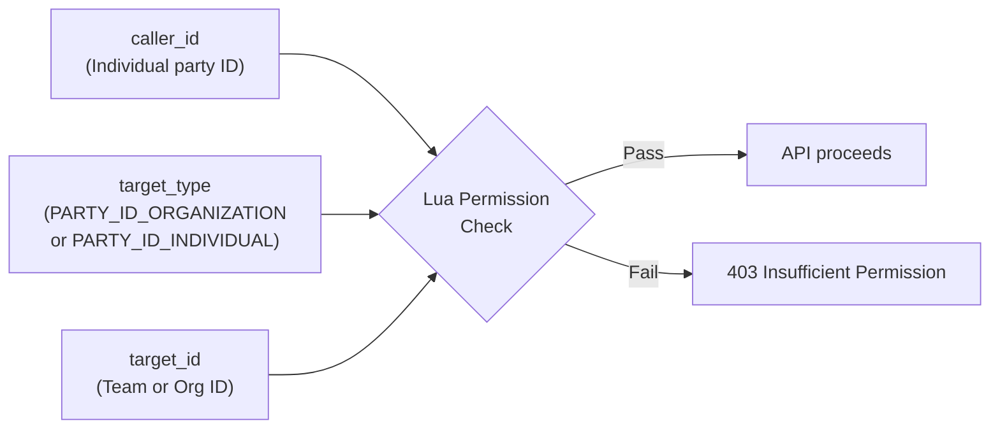


### How Team Admins Get Access to All Teams

When a user is `ADMIN` of the **root organization**, they automatically have access to all child teams via **permission aliases** (set during invitation acceptance or organization creation). This means:

- `ADMIN` on root org → effective `ADMIN` on all child teams without needing explicit permission on each

---

## 11. Configuration Reference

### `PARTY_MANAGEMENT_EXPERIENCE_CONFIG` (per-operator)


| Key                                  | Type       | Required                   | Description                                                                                                                       |
| ------------------------------------ | ---------- | -------------------------- | --------------------------------------------------------------------------------------------------------------------------------- |
| `dashboard_app_domains`              | `string[]` | Optional                   | Allowed FE dashboard URLs for invitation links. If configured, `invitationUrl` in invite requests must match one of these values. |
| `direct_channel_partner_id`          | `string`   | For DIRECT onboarding      | ID of ChannelPartner PartyRole to attach AppOwner to on user creation.                                                            |
| `onboarding_type`                    | `string`   | Yes                        | `DIRECT` or `WHOLESALE` — controls which party roles are provisioned during registration.                                         |
| `individual_default_permission_role` | `string`   | For internal user creation | Role assigned to newly created individuals over themselves.                                                                       |


### `EXTERNAL_IDP_CONFIG` (per-operator, optional)

Only needed for operators using **Microsoft Entra ID** integration.

```yaml
EXTERNAL_IDP_CONFIG:
  OPERATOR_NAME:
    provider: "entra"
    authMethod: "client_secret"           # or "jwt_client_assertion_certificate"
    tenantId: "<Azure AD Tenant ID>"
    clientId: "<App Registration Client ID>"
    clientSecret: "<Secret>"              # for client_secret auth method
    certificate: "<X.509 cert string>"    # for jwt_client_assertion_certificate auth method
    privateKey: "<Private key string>"    # for jwt_client_assertion_certificate auth method
    scopeGroupId: "<Entra Group ID>"
    accessPackageId: "<Access Package ID>"
    tenantDomain: "<e.g. contoso.onmicrosoft.com>"
    inviteRedirectUrl: "<KC broker or portal URL>"
    tokenEndpointBaseUrl: "https://login.microsoftonline.com"   # optional, this is the default
    accessPackageBaseUrl: "https://myaccess.microsoft.com"      # optional, this is the default
```

### Required Service Dependencies


| Service                           | Why                                                |
| --------------------------------- | -------------------------------------------------- |
| `partyManagement`                 | Create/manage Organization and Individual entities |
| `partyRolesPermissionsManagement` | Create ChannelPartner, AppOwner party roles        |
| `digitalIdentityManagement`       | Link Keycloak IDP ID to Individual party ID        |
| `authorization` (Lua)             | AuthZ permission management                        |
| `CEP / Campaigns`                 | Email delivery via Kafka events                    |
| Keycloak                          | AuthN (token issuance and user verification)       |


---

## 12. Roadmap & Future Enhancements

---

### R1 – Role Management Enhancement

**Status:** In Progress | **JIRA Epic:** [AMPL-2875](https://jira.lotusflare.com/browse/AMPL-2875)

**Summary:** The current role model does not distinguish between root organization context and team context, and role validation behavior is inconsistent across APIs. This enhancement introduces context-aware role validation, explicit root-to-team inheritance rules, and tenant-configurable role policies — without changing the underlying Lua permission model.

**Key Changes:**


| Area                 | Change                                                                                                                                                                         |
| -------------------- | ------------------------------------------------------------------------------------------------------------------------------------------------------------------------------ |
| Role validation      | Validate allowed role set per organization context (root org vs. team) across all write paths: create invitation, update member role, add member (internal)                    |
| Inheritance behavior | Make root-to-team admin propagation explicit and consistent (create team, accept invitation, role downgrade/upgrade)                                                           |
| Tenant configuration | Introduce per-operator config keys (`allowed_root_org_roles`, `allowed_team_roles`, `default_parent_org_role_for_team_member`) to control role policies without code branching |
| Role resolution      | Replace static role mapping with operator-aware runtime resolution across all read/write paths (invitations, team members, user profile)                                       |
| Frontend             | Show context-sensitive role options in invite and member-edit flows; hide or disable roles disallowed by tenant policy                                                         |


**Planned User Stories (7 stories, recommended Option A):**

1. Define canonical role model and business rules
2. Enforce context-aware role validation for invitations and member management
3. Make root-to-team inheritance behavior explicit and consistent
4. Introduce tenant-configurable role policy in backend
5. Refactor role mapping to be operator-aware across all read/write paths
6. Provide tenant configuration templates and rollout readiness
7. Update frontend role UX (context-sensitive role selectors)

> Lua role mapping remains fixed: `ADMIN → operateApiAdmin`, `TEAM_MANAGER → operateApiEditor`, `DEVELOPER → operateApiViewer`.

---

### R2 – Bulk Invitation

**Status:** Planned (next sprint) | User story in preparation

**Summary:** The current invitation flow requires users to be invited one at a time. Telus's frontend portal has indicated a requirement to support bulk invitation. The proposed UX (as observed in the Telus DevEdge portal) works as follows:

1. **Step 1 — Stage invitees:** Admin types multiple email addresses (comma-separated) into the email input field and clicks **Add**. Added emails are staged in a preview list within the modal.
2. **Step 2 — Assign roles:** Each staged invitee can be assigned a different role individually before sending.
3. **Step 3 — Confirm:** Admin clicks **Confirm** to dispatch all invitations in a single submission.

**Key Changes:**


| Area          | Change                                                                                                                                                                                                              |
| ------------- | ------------------------------------------------------------------------------------------------------------------------------------------------------------------------------------------------------------------- |
| Frontend      | Multi-email input with comma-separated entry; per-invitee role assignment in a staging list before confirmation                                                                                                     |
| Backend       | The existing `POST /v1/invitations` already accepts an array of invitations; bulk-specific enhancements may include increased input limits, partial-failure handling, and per-item status reporting in the response |
| Validation    | Expand duplicate/existing-member checks to handle batch context — clearly report which individual invitations succeeded or failed without failing the entire batch                                                  |
| Notifications | Ensure Kafka events are emitted and invitation records persisted correctly for each invitee in the batch                                                                                                            |


---

### R3 – Application-Scoped Team Permissions

**Status:** Under Discussion | Approach TBD

**Reference:** [Architecture Proposal (Google Slides)](https://docs.google.com/presentation/d/1H-J_tdZKNKlrud5pSphnmWGL_wHjKu6gsxF2UkQc2VE/edit?usp=drive_link)

---

#### Background & Current State

To evaluate options, it is necessary to understand the current entity relationships:

```
rootOrg (Organization, isHeadOffice=true)
├── relatedParty: Individual         (role: operateApiAdmin)
├── relatedParty: ApplicationOwner   (DIRECT only — one AppOwner per rootOrg)
│   └── relatedParty: ChannelPartner (fixed reference from operator config)
├── relatedParty: Customer
└── organizationChildRelationship:
    └── Team (child Organization)
        └── relatedParty: Individual (team members with roles)
            (no ApplicationOwner association)
```

**Key structural facts (from codebase analysis):**

- There is **no explicit Application entity** in the current data model. An "application" is conceptually represented by the `ApplicationOwner` PartyRole attached to a `rootOrg`.
- `ApplicationOwner` is **rootOrg-scoped**: one AppOwner is created per root organization at onboarding time. Its ownership does not change after creation.
- **Teams have no relationship to ApplicationOwner** — there is currently no mechanism to express "team X manages application Y."
- The Lua authorization service supports **permission aliases** (`Organization → ApplicationOwner` for DIRECT, `Organization → ChannelPartner` for WHOLESALE). This mechanism is the key extension point for this feature.
- `relatedParty` arrays on party roles already support role-typed references (demonstrated by `ApplicationOwner → ChannelPartner`), making it structurally possible to add `ApplicationOwner → Team` references without schema changes.

---

#### Goal

Enable an admin to assign one or more applications to one or more teams, controlling **which team manages which application** and at **what permission level** (admin, manager, or viewer). Members of an assigned team should automatically inherit the configured access to the application's resources (product, order, usage, billing) based on their team role.

---

#### Proposed Approach: Team–ApplicationOwner Assignment via Lua Permission Aliases

Rather than introducing a new entity or changing who "owns" the ApplicationOwner, the proposal is to **extend the Lua permission alias mechanism to the team level**, creating a controlled many-to-many relationship between teams and ApplicationOwner party roles.

**Core model extension:**

```
rootOrg (unchanged)
├── ApplicationOwner (unchanged — still owned by rootOrg)
└── Team (Organization)
    ├── relatedParty: Individual (team members — unchanged)
    └── [NEW] Lua permission alias: Team → ApplicationOwner (with scoped role)
```

The admin creates an assignment by configuring a Lua permission alias from a Team to an ApplicationOwner. This means:
- A team member with role `operateApiAdmin` on Team → gets `operateApiAdmin` effective access on the assigned ApplicationOwner
- A team member with role `operateApiViewer` on Team → gets `operateApiViewer` effective access only
- Multiple teams can be assigned to the same ApplicationOwner (co-management)
- One team can be assigned to multiple ApplicationOwners (cross-application team)

**Why this approach is preferred:**

| Consideration | Detail |
|---|---|
| No schema change to AppOwner | AppOwner ownership and creation flow remain identical; rootOrg still "holds" AppOwner |
| Leverages existing Lua alias mechanism | The `set_permission_alias` capability already exists and is used today (`Organization → AppOwner` at rootOrg level) |
| Supports many-to-many | Multiple teams can share access to one AppOwner; one team can manage multiple AppOwners |
| Role-scoped | Each assignment carries a specific role, enabling fine-grained control (admin vs viewer per team) |
| Extensible to resource types | Future resource types (product, order, billing) can be added as additional alias targets without model changes |
| Reversible | Removing a team's access is a Lua permission alias deletion — no party data is mutated |

---

#### New APIs Required

| Method | Path | Description |
|---|---|---|
| `POST` | `/v1/teams/:teamId/applications/:appOwnerId` | Assign an ApplicationOwner to a team with a specified role |
| `DELETE` | `/v1/teams/:teamId/applications/:appOwnerId` | Revoke a team's access to an ApplicationOwner |
| `GET` | `/v1/teams/:teamId/applications` | List all ApplicationOwners accessible to a team |
| `GET` | `/v1/applications/:appOwnerId/teams` | List all teams that have access to an ApplicationOwner |

#### New Orchestration Plans Required

| Plan | Key Steps |
|---|---|
| `team_mgmt_exp_assign_application_to_team` | Validate team and AppOwner exist within same rootOrg → Call Lua `set_permission_alias` (Team → AppOwner, with role) |
| `team_mgmt_exp_revoke_application_from_team` | Call Lua `delete_permission_alias` (Team → AppOwner) |

---

#### Permission Rules

| Action | Required Role |
|---|---|
| Assign application to team | `ADMIN` on rootOrg |
| Revoke application from team | `ADMIN` on rootOrg |
| View assigned applications for a team | Any member of the team |
| Access application resources via team role | Member of an assigned team (role-scoped) |

> An `ADMIN` of the rootOrg always has effective access to all applications (via existing rootOrg → AppOwner alias). The new team-level assignment is additive and does not affect this.

---

#### Future Extension: Resource-Level Permission Granularity

Once team–application assignment is established, the same alias mechanism can be extended to sub-resource types:

| Resource Type | Alias Target | Notes |
|---|---|---|
| Product management | ProductOffering / Product entity | Requires ProductOffering to be modelled as a party role or linked entity |
| Order management | ProductOrder entity | Same pattern |
| Usage monitoring | UsageSpecification entity | Same pattern |
| Billing management | BillingAccount entity | Same pattern |

This would allow future configurations such as: "Team A can manage products and orders for Application X, but Team B can only view billing for Application X."

---

#### Open Questions

> - Should the assignment role be **the same as the team role** (i.e. a DEVELOPER on Team A gets DEVELOPER access to Application X), or should assignments carry an **independent role override** per application?
> - Should teams outside a rootOrg's hierarchy (e.g. from a different tenant) ever be assignable to an ApplicationOwner? (Current answer: No — same-rootOrg only.)
> - Is the `ApplicationOwner` PartyRole the right granularity for "application", or does the product domain need to introduce a proper `Application` entity first?
> - How should this interact with the WHOLESALE model, where `ChannelPartner` (not `ApplicationOwner`) is the root alias target?

---

### R4 – Resend Invitation & Invitation Audit Trail

**Status:** Planned | Requirements in progress

**Summary:** Currently there is no mechanism to resend a pending invitation, and the invitation record only captures `invitationTime` (when the invitation was originally created). This enhancement adds a resend capability with a configurable per-operator cooldown period, and extends the invitation data model to track a richer audit trail of invitation lifecycle timestamps.

#### Resend Invitation

The proposed UX (as observed in the Telus DevEdge portal) exposes a **Resend** action in the Invitations tab dropdown per invitee. On click, a confirmation modal is shown ("The invitee will receive a new email at the same address."), and on confirm the invitation email is re-dispatched.

**Business Rules:**

- A resend is only allowed for invitations in `PENDING` status (not `ACCEPTED` or `REVOKED`)
- A minimum cooldown of **24 hours** must have elapsed since the last send (original or resend) before another resend is permitted
- The cooldown duration is **tenant-configurable** to accommodate different operator policies

**Key Changes:**

| Area | Change |
|---|---|
| Backend | New resend API endpoint (e.g. `POST /v1/invitations/:id/resend`) or extend existing internal emit endpoint; enforce cooldown check against `lastSentAt` timestamp |
| Data model | Add `lastSentAt` field to the `Invitation` entity to track when the most recent email was dispatched |
| Tenant configuration | Introduce `invitation_resend_cooldown_hours` operator config key (default: `24`); resolves per operator at runtime |
| Frontend | Resend option in invitations list dropdown; show confirmation modal; disable Resend action if within cooldown window (optionally show remaining wait time) |
| Notifications | Re-emit `lf_party_management_experience_invite_email` Kafka event with same `invitationCode`; CEP delivers the email again |

#### Invitation Audit Trail

The current `Invitation` entity only stores `invitationTime` (creation time). To support resend tracking, compliance requirements, and better operational visibility, the following timestamp fields should be introduced:

| Field | Description |
|---|---|
| `invitationTime` | *(existing)* When the invitation record was first created |
| `lastSentAt` | When the invitation email was most recently dispatched (original send or latest resend) |
| `acceptedAt` | When the invitee accepted the invitation (status transitioned to `ACCEPTED`) |
| `revokedAt` | When the invitation was revoked (status transitioned to `REVOKED`) |

> **Open Questions:**
> - Should resend history (each resend timestamp) be stored as a log/array, or is `lastSentAt` sufficient?
> - Should there be a maximum resend count per invitation (e.g. limit to 5 resends)?
> - `acceptedAt` and `revokedAt` may alternatively be derived from an audit log service if one exists, to avoid widening the `Invitation` schema further.

---

### R5 – Copy Invitation Link

**Status:** Planned | Requirements in progress

**Summary:** In cases where an invitation email is filtered or blocked by the invitee's mail server, the inviting admin should be able to retrieve the invitation link directly and share it via an alternative channel (e.g. Slack, SMS).

**Feasibility & Security Analysis:**

The existing `GET /v1/invitations` API already returns `invitationCode` in the `InvitationDTO` response, so the technical foundation is already in place. The backend requires **no changes**.

Security risk is assessed as **low** for the following reasons:

- `invitationCode` is a cryptographically random 32-byte `base64url` string — not guessable
- `POST /v1/invitations/accept` enforces email matching at acceptance time: the accepting user's Keycloak token email must match the invitation's `email` field — even if the link is intercepted, it cannot be accepted by a different user
- The primary risk is link leakage via unencrypted channels, but the email-match guard significantly limits exploitability

**Key Changes:**

| Area | Change |
|---|---|
| Frontend | Add a "Copy invitation link" action to the per-invitee dropdown in the Invitations tab; constructs the full acceptance URL from `invitationCode` and copies it to the clipboard |
| Backend | No changes required — `invitationCode` is already returned in `GET /v1/invitations` |
| UX note | The copy link action should only be available for invitations in `PENDING` status |

---

### R6 – User-Initiated Join Request

**Status:** Idea | Under consideration

**Summary:** Currently, joining a team or organization requires an admin to first send an invitation. There is no mechanism for a user to proactively discover and request to join an existing organization or team. This feature would allow users to self-initiate a join request, which an admin could then approve or reject.

**Proposed Flow:**

1. A user with an existing account discovers an organization they wish to join (e.g. via a shared org link or join page)
2. User submits a join request, optionally with a message
3. Admin of the target organization receives a notification and can **Approve** or **Decline**
4. On approval, the user is added to the organization with a specified role (same as invitation acceptance flow)
5. On decline, the request is closed with no action

**Key Considerations:**

| Aspect | Detail |
|---|---|
| Discovery mechanism | How users find an organization to join needs to be defined (e.g. shareable org URL, join code) |
| Role assignment | Who determines the role at approval time — the requesting user, the admin, or a default? |
| Data model | Requires a new `JoinRequest` entity (or extension of the `Invitation` model with a new `source = JOIN_REQUEST`) |
| Notification | Admin needs to be notified of incoming join requests (new Kafka event type or in-app notification) |
| Org visibility | Not all organizations should be discoverable — needs a per-org `isJoinable` or similar configuration flag |

> This feature is the inverse of the invitation flow and would significantly reduce friction for users onboarding into organizations they are already affiliated with through other channels.

